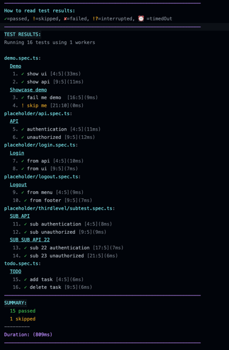

# indent-list-reporter

Playwright list reporter with colorful terminal output and indentation

#### IMPORTANT NOTE: 
  Version 1.0.8 is with commonjs module system.
  Version 1.0.9 with es2017 module, and jest unit tests were migrated to vitest

#### Purpose:

- I wanted to have a reporter that displays the tests in a hierarchical format with indentation and colorful terminal
  output,
  so that I could see right away the hierarchy of the tests without having to scroll horizontally and strain my eyes.
- From the colors we can distinguish the different test states (passed, failed, skipped, etc.),
  and also by the indentation level, we can see all the tests inside a suite.
- I also wanted to learn how to build a custom reporter for Playwright, and this was a good opportunity to do so.

#### Information:

Indent List Reporter is a reporter for Playwright that displays the list of tests in a hierarchical format with
indentation.
Colors are configurable by passing some options to the reporter.
It is based on the [list reporter](https://playwright.dev/docs/test-reporters/#list) but with a twist.
It is a list reporter with indentation and colorful terminal output.
It is build using the custom reporter API of Playwright.  
Read more on how to set/build a custom reporter with
Playwright [here](https://playwright.dev/docs/test-reporters/#custom-reporters).

## Getting Started
### Installation
    
```bash
npm install indent-list-reporter --save-dev
```

### Usage
#### With default options 
The default options are:
```typescript
{
  ignoreColors: false, 
  baseColors: {
    specFileNameColor: "cyan",
    suiteDescriptionColor: "cyan",
    testCaseTitleColor: "white"
  }
  environment: 'dev'
}
```
The available colors are: 
```typescript
export type ColorsAvailable = "black" | "red" | "green" | "yellow" | "blue" | "magenta" | "cyan" | "white" | "gray";
```

Add the customer reporter to your playwright.config.ts file in the reporter array, like in the example below:
```typescript
    export default defaultConfig({
      //...
      reporter: [['indent-list-reporter']],
      //...
    });
```

#### With custom color options
Example #1: 
If you want to ignore all colors, you can pass the `ignoreColors: true` option to the reporter.
This will show the tests with white foreground color. 
```typescript
    export default defaultConfig({
      //...
      reporter: [['indent-list-reporter'], {
        ignoreColors: true,
      }],
      //...
    });
```

Example #2: 
If you want to change the colors of the reporter, you can pass the `baseColors` option to the reporter.
This will change the colors of the reporter to the ones you specify.
The background color is not yet configurable. For now the default background color of your terminal will be used.

```typescript
    export default defaultConfig({
      //...
      reporter: [[
          "indent-list-reporter",
          {
            ignoreColors: false,
            baseColors: {
              specFileNameColor: "cyan",
              suiteDescriptionColor: "cyan",
              testCaseTitleColor: "white",
            },
            environment: "dev",
          },
        ],
      ],
      //...
    });
```

#### See how it looks


## ISSUES 
If you find any issues, please report them [here](https://github.com/syzzana/indent-list-reporter/issues)
Feel free to open any issues or feature requests, and I will try to address them as soon as possible. 

## NOTE
This is my first open-source project, and it might miss a lot of feature or have a lot of bugs(definitely).
You can find [here](https://github.com/syzzana/indent-list-reporter/issues) the list of issues and features that I am currently working on. 
I am open to any suggestions on how to improve this project, your input is very valuable to me.
I am also open to any suggestions on how to improve the code, as I am still learning TypeScript and NodeJS.
Also, open to any suggestion on best practices on open-source projects, documentation, etc.

## LICENSE
This project is licensed under the [MIT License](https://opensource.org/licenses/MIT).

## ACKNOWLEDGEMENTS
- [Playwright](https://playwright.dev/) for the awesome tool and documentation.
- [Playwright Solutions](https://playwrightsolutions.com) for the awesome content and explination of examples. 
## CONTACT
- [LinkedIn](https://www.linkedin.com/in/syzanakajtazaj)
- [GitHub](https://github.com/syzzana)
- [Buy me a coffee](https://www.buymeacoffee.com/syzzana)

